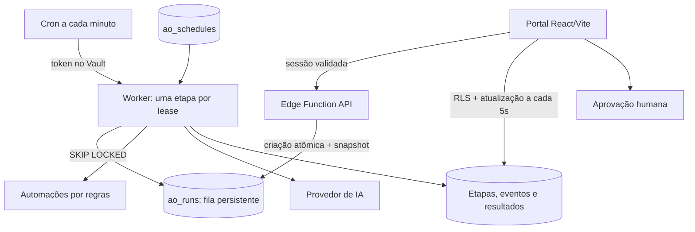

# Arquitetura operacional

Fonte: `docs/architecture/diagrams/control-execution-plane.mmd`. Atualizado em 26/09/2026.

```mermaid
flowchart TB
  UI[Portal React/Vite] -->|sessão validada| API[Edge Function API]
  API -->|criação atômica + snapshot| Queue[(ao_runs: fila persistente)]
  Cron[Cron a cada minuto] -->|token no Vault| Worker[Worker: uma etapa por lease]
  Schedules[(ao_schedules)] --> Worker
  Worker -->|SKIP LOCKED| Queue
  Worker --> Rules[Automações por regras]
  Worker --> AI[Provedor de IA]
  Worker --> Results[(Etapas, eventos e resultados)]
  UI -->|RLS + atualização a cada 5s| Results
  UI --> Review[Aprovação humana]
```
