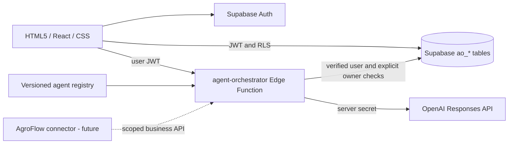

# RPA Automatic · Agent OS

Version 0.2 — 2026-09-05

## Product and implementation boundary

Agent OS is a browser control plane for authenticated, persistent, sequential agent workflows. It generates plans, architectures, automation proposals and reviews. It does not execute generated code, release shipments, send messages or write to customer systems. Those capabilities require a separate execution plane and scoped connectors.

HTML5 semantic sections and forms, React 19, TypeScript, native responsive CSS, the existing Tailwind/shadcn catalog and the existing vinext/Vite Worker runtime power the interface. Preserve Sites as the current host rather than combining a host migration with backend integration.

## Architecture

## Trust boundaries

- The Sites access gate currently restricts the website to the owner. Supabase Auth independently authenticates application users.
- Frontend exposes only a publishable Supabase key. It cannot write runs, decisions or audit events directly.
- The Edge Function validates every bearer token with Auth `getUser` before using its service-role client. `verify_jwt=false` disables the legacy platform precheck, not application authentication. Requests without a valid user return 401.
- RLS restricts reads by `owner_id`; a unique owner workspace and composite `(workspace_id, owner_id)` foreign keys prevent cross-workspace references.
- This release has one workspace per user. Team invitations and reviewer RBAC are **not implemented**; do not advertise shared enterprise workspaces yet.
- The service-role secret is provided by the Supabase runtime. The OpenAI key stays in Edge Function secrets. No secret-entry form exists in the browser.
- Knowledge and prior agent outputs are explicitly labeled untrusted and cannot grant permissions. No provider tools or arbitrary URLs are accepted.

## Data model

| Table | Responsibility | Browser permissions |
| --- | --- | --- |
| ao_workspaces | One isolated workspace per Auth user | Own SELECT and INSERT |
| ao_runs | Task, workflow, mode, steps, decision, lease | Own SELECT only |
| ao_events | Append-only status history from database trigger | Own SELECT only |
| ao_memory | User-approved contextual notes | Own SELECT, INSERT, DELETE |

All new objects are prefixed `ao_`. Existing logistics and fiscal tables remain unchanged. Old MVP migrations are archived under `supabase/legacy-migrations/` and are not part of this release's deploy sequence.

## Workflow and contracts

Four agents in `agents/registry.json`: Atlas (planning), Nova (architecture), Flux (automation), Sentinel (review). `supabase/functions/agent-orchestrator/registry.json` is the deploy copy; tests enforce equivalence.

The workflow selector changes business context and seed prompt. All three current workflows execute the same four agents in the same order. Agents generate Markdown proposals, not external tool actions.

States: `queued → running → queued` for intermediate steps; final step enters `waiting_approval → completed | rejected`. Failures enter `failed`; operators can cancel a queued/running run. A stale running step can be marked failed after two minutes. No automatic retry of provider calls avoids silent duplicate charges.

Each advance request claims a run with a compare-and-set and UUID lease. Only the claim holder may save output. Each result persists before the next browser request. Closing the browser can interrupt orchestration; it is not yet a durable background worker. Reopen and continue queued runs. Interrupted running jobs require explicit recovery.

Creation accepts a client-generated UUID as its idempotency key. Per-owner advisory locking enforces at most one queued/running run and 30 new runs per rolling day. The four-agent limit and 1,600 output-token cap per agent bound output usage; input tokens and model pricing still affect the bill. There is no currency budget enforcement yet.

Decision operations atomically require `waiting_approval`. Acceptance records review only. It does not publish code or approve a shipment.

## API

POST `/functions/v1/agent-orchestrator`, JSON body:

- `health`: authenticated provider configuration status (never the key).
- `create`: `id`, `workspace_id`, `prompt` (12–8000 chars), `workflow` (`engineering|rpa|agro`), `mode` (`demo|openai`).
- `advance`: `id`; executes one step.
- `decision`: `id`, `decision` (`approved|rejected`).
- `cancel`: `id`.
- `recover`: `id`; marks a running job older than two minutes failed.

Allowed browser origins are the existing Sites origin and local development ports 5173/5174. Extend this list explicitly when adding a production domain. CORS is not authentication.

## Memory, artifacts and usage

Up to three latest notes (2,500 chars each) and bounded previous outputs are included in an OpenAI step. This is deterministic contextual retrieval, not vector search. Outputs and reported token counts are persisted in `ao_runs.steps`. The browser exports Markdown from these persisted artifacts; Storage uploads are not implemented.

## Provider integration

OpenAI Responses API, `store:false`, 60-second timeout, configurable `OPENAI_MODEL`, default `gpt-4.1-mini`, 1,600 max output tokens. Only a completed text response is accepted. Incomplete/provider failures preserve completed steps and fail the run. Demo mode uses fixed templates, emits zero tokens and is explicitly labeled throughout.

Reference: https://developers.openai.com/api/reference/typescript/resources/responses/methods/create

## Next product increments

1. Configure and validate OpenAI with a real user and small sanitized task.
2. Durable worker/queue, retries with provider-aware idempotency and full server scheduling.
3. Team membership and reviewer RBAC, lifecycle and audit export.
4. Scoped GitHub read connector, isolated code worker and reviewed draft PRs.
5. MCP gateway with per-tool allowlists and exact-payload approvals.
6. AgroFlow integration after restoring its dedicated project and validating business rules.
