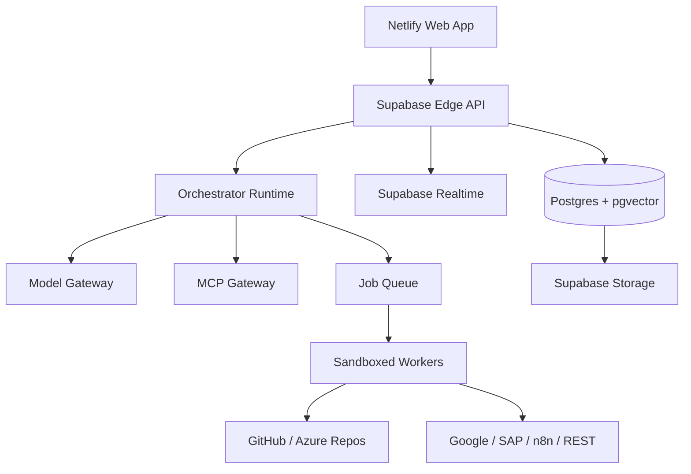

# Software Design Document

> Status: Arquivado  
> Responsável: @RodrigoFreitas16n91  
> Versão: 0.1  
> Última revisão: 2026-09-13  
> Substituído por [`../architecture/SDD.md`](../architecture/SDD.md). Este documento preserva hipóteses e desenho-alvo anteriores à reconciliação com a implementação React/Vite atual.

## Code Agent Orchestrator Portal and ChatGPT Multi-Agent Operating Model

**Author:** Rodrigo Feitosa Freitas  
**Version:** 1.0  
**Date:** 2026-09-05  
**Status:** Ready for implementation  
**Primary outcome:** a personal, secure and extensible control plane for daily vibe coding, agentic automation and a live Cubo Connect demonstration.

---

## 1. Executive summary

This SDD defines two connected deliverables:

1. **Code Agent Orchestrator Portal:** a web application that receives a task, plans the work, selects models and agents, loads skills/instructions/memory, executes tools and MCP servers, requests human approval for risky actions, and produces traceable artifacts such as code, pull requests, tests, documentation and deployment reports.
2. **ChatGPT Multi-Agent Operating Model:** a practical design for creating and presenting reusable multi-agent workflows inside ChatGPT, using Agent Builder/Workspace Agents where available, skills, files, memory, approved apps and custom MCP tools. The model is optimized for a short, credible Cubo Connect demo.

The portal is intentionally a **control plane**, not a replacement for every model provider or execution environment. Supabase provides identity, relational data, vector retrieval, storage, realtime events and edge functions. Netlify provides the web frontend and deployment pipeline. Long-running or privileged execution is delegated to isolated workers through a queue and a job protocol.

The design supports Rodrigo's existing ecosystem: Python, JavaScript, C#, REST APIs, LangChain/LangGraph, n8n, Git/GitHub/Azure Repos, GCP/BigQuery/Google Workspace, SAP/TOTVS/ServiceNow integrations, Docker and local Ollama models.

## 2. Product vision

**Vision:** describe the outcome once; the portal turns it into a controlled, observable and repeatable engineering workflow.

**Product promise:**

- “I can start a task from one workspace and see what every agent is doing.”
- “My skills, instructions and project memory are reusable assets, not text copied into every prompt.”
- “The system can use cloud or local models without redesigning the workflow.”
- “Agents can create code and artifacts, but sensitive or irreversible actions require approval.”
- “Every run is explainable: input, plan, tool calls, outputs, costs, errors and decisions are recorded.”

## 3. Scope

### 3.1 In scope

- Authentication, workspace and project isolation.
- Task intake through a chat-like composer and structured task form.
- Agent registry and multi-agent workflow definitions.
- Skill registry with versioning, dependencies, allowed tools and test cases.
- Instruction templates and project policies.
- Memory with user, workspace, project, agent and run scopes.
- Model-provider abstraction for OpenAI, Anthropic, Google, local Ollama and compatible OpenAI endpoints.
- MCP server registry and tool discovery.
- Code Assist connected to repositories, branches, issues and pull requests.
- Plan/execute/review stages and human approval gates.
- Run timeline, logs, traces, token/cost estimates and artifact catalog.
- Supabase migrations, RLS, Storage, pgvector, Realtime and Edge Functions.
- Netlify frontend deployment and preview environments.
- Worker protocol for Python/Node/Docker executors.
- Demo configuration for the Cubo Connect event.

### 3.2 Out of scope for MVP

- Fully autonomous production deployment.
- Arbitrary shell execution inside the web frontend.
- Storing provider API keys in browser local storage.
- Guaranteeing that any model can complete any task without human review.
- Replacing GitHub/Azure DevOps, n8n, LangGraph or ChatGPT; the portal orchestrates them.
- Building a complete enterprise IAM/SCIM platform in the first release.

## 4. Personas and primary use cases

### 4.1 Rodrigo - builder/operator

Creates an application, automation, integration or architecture document. He wants a short path from idea to plan, implementation, validation and artifact delivery.

### 4.2 Reviewer/approver

Reviews generated plans, diffs, tool calls, deployment requests and external side effects before approval.

### 4.3 Agent/worker

Executes a bounded responsibility such as discovery, architecture, coding, testing, documentation, security review or deployment preparation.

### 4.4 Core scenarios

| ID | Scenario | Expected result |
|---|---|---|
| UC-01 | “Create a Python API with Supabase and tests” | Planner decomposes the task; architect proposes design; coder changes a repository; tester runs checks; reviewer summarizes the result. |
| UC-02 | “Analyze this process and design an RPA/APA solution” | Process analyst extracts requirements; solution architect produces PDD/SDD; integration agent maps APIs/MCP; artifact is saved. |
| UC-03 | “Update a project based on an issue” | Code Assist reads issue and repository context, proposes a plan and patch, runs tests, and opens a draft PR after approval. |
| UC-04 | “Prepare my daily presentation” | Researcher gathers approved context; storyteller creates narrative; critic checks clarity; slide agent creates a presentation outline and speaker notes. |
| UC-05 | “Execute an SAP/Google Workspace/n8n action” | The workflow identifies a write action, requests approval, executes through a constrained connector and records evidence. |
| UC-06 | “Use my local model” | Model gateway routes selected steps to Ollama through a worker without exposing the local endpoint to the browser. |

## 5. Architectural principles

1. **Human control over side effects:** reads may be automatic; writes, messages, deploys, deletes and credential operations are approval-controlled.
2. **Provider independence:** agents request capabilities, not hard-coded vendors. A provider adapter maps capability to a model.
3. **Least privilege:** every agent, skill, MCP server and worker has an explicit allowlist.
4. **Reproducible runs:** a run captures versions of instructions, skills, model configuration, tools and memory references.
5. **Small agents, explicit handoffs:** each agent has one responsibility and a typed input/output contract.
6. **Artifacts over chat-only output:** code, diffs, documents, tests, JSON and decisions are first-class outputs.
7. **Fail closed:** missing permissions, invalid tool schemas, untrusted content or uncertain write actions stop for review.
8. **Progressive autonomy:** draft -> review -> execute -> publish. Autonomy is earned per workflow and environment.

## 6. Target architecture



### 6.1 Frontend

- **Framework:** Next.js with TypeScript and App Router, deployed to Netlify.
- **UI:** Tailwind CSS, shadcn/ui, accessible command palette and responsive three-panel run view.
- **State:** TanStack Query for server state; lightweight local state for composer, filters and optimistic UI.
- **Realtime:** Supabase Realtime subscribes to run events and approval changes.
- **Security:** Supabase session is used only for authenticated API calls; provider secrets never reach the browser.

### 6.2 Backend/control plane

- **Supabase Auth:** email/password initially; OAuth later.
- **Postgres:** source of truth for configuration, tasks, runs, approvals and metadata.
- **pgvector:** embeddings for project memory, skills and indexed artifacts.
- **Storage:** uploaded specifications, generated documents, logs, test reports and exports.
- **Edge Functions:** thin authenticated API façade, webhook receivers, embedding jobs and event fan-out.
- **Orchestrator runtime:** TypeScript or Python service implementing the state machine and worker protocol. For MVP it may run as a protected service; long-running work must move to a worker.
- **Queue:** Supabase-backed job table for MVP; Redis/Upstash or a managed queue for scale.

### 6.3 Execution plane

Workers are isolated processes or containers. A worker receives a signed job envelope, fetches only approved context, invokes allowed tools and returns structured results. Recommended implementations:

- Python worker for LangGraph, repository analysis, test execution and data tasks.
- Node/TypeScript worker for MCP clients, webhooks and frontend-adjacent tasks.
- Docker worker for reproducible project builds and test environments.
- Optional local worker for Ollama and local filesystem/repository access.

## 7. Domain model

### 7.1 Core entities

| Entity | Purpose | Key fields |
|---|---|---|
| workspace | Tenant boundary | id, name, owner_id |
| project | Repository, product or automation boundary | id, workspace_id, name, repo_url, default_branch, policy |
| agent | Reusable role or workflow node | id, project_id, name, type, instructions, model_profile |
| workflow | Directed graph of agents and transitions | id, project_id, definition_json, version |
| skill | Versioned operating procedure | id, slug, version, body, dependencies, allowed_tools |
| instruction_set | Reusable prompt/policy block | id, scope, content, priority |
| memory_item | Searchable contextual fact or decision | id, scope, content, embedding, provenance, expires_at |
| model_provider | Provider configuration reference | id, provider, endpoint_ref, capabilities |
| mcp_server | Approved tool server | id, name, endpoint_ref, auth_type, trust_level |
| mcp_tool | Discovered action or resource | id, server_id, name, schema, risk_level |
| task | User request | id, project_id, prompt, status, priority |
| run | One execution attempt | id, task_id, workflow_version, status, started_at, finished_at |
| run_step | Agent node execution | id, run_id, agent_id, input, output, status, retries |
| approval | Human gate | id, run_id, action, risk, status, decided_by |
| artifact | Generated or changed output | id, run_id, type, storage_path, checksum |
| evaluation | Quality/safety result | id, run_id, evaluator, score, findings |
| audit_event | Immutable activity record | id, workspace_id, actor, action, target, metadata |

### 7.2 State machines

**Task:** `draft -> planned -> approved -> running -> completed | failed | cancelled`  
**Run:** `queued -> running -> waiting_approval -> running -> completed | failed | cancelled`  
**Approval:** `pending -> approved | rejected | expired`  
**Artifact:** `generated -> validated -> accepted | superseded`

## 8. Agent and workflow contracts

Every agent definition must include:

```yaml
name: solution-architect
purpose: Produce implementable technical designs from approved requirements.
inputs:
  - requirements
  - project_context
outputs:
  - architecture_document
  - decisions
  - open_questions
allowed_tools:
  - repository.read
  - memory.search
  - artifact.write
forbidden_tools:
  - production.deploy
approval_policy: no_write_without_approval
quality_gates:
  - contains_scope_and_non_scope
  - identifies_security_and_data_risks
  - includes_acceptance_criteria
```

Workflow nodes communicate with typed envelopes:

```json
{
  "run_id": "uuid",
  "step_id": "uuid",
  "input": {"task": "...", "context_refs": []},
  "constraints": {"time_seconds": 300, "max_cost_usd": 1.0},
  "permissions": {"tools": ["repo.read", "artifact.write"], "writes": false},
  "expected_output_schema": "architecture.v1"
}
```

Recommended default workflow:

1. **Intake agent:** normalizes the request and identifies missing information.
2. **Planner agent:** decomposes the task, chooses skills and proposes a graph.
3. **Architect agent:** defines solution, interfaces, data model and risks.
4. **Implementer agent:** changes code or creates artifacts in a branch/workspace.
5. **Tester agent:** runs tests, lint, type checks and smoke tests.
6. **Security/reviewer agent:** checks secrets, permissions, injection risks and requirements.
7. **Presenter agent:** converts results into a human-readable summary, demo script or slides.

## 9. Skills, instructions and memory

### 9.1 Skill format

Each skill is a directory or database record with:

```yaml
name: api-integration-design
description: Design and validate REST/API integrations.
version: 1.0.0
triggers: [api, webhook, integration, connector]
instructions: SKILL.md
references: [openapi-checklist.md]
tools: [http.read, artifact.write, memory.search]
inputs: [requirements, existing_api_docs]
outputs: [integration_design, risks, test_cases]
tests: [fixtures/api-integration/*.yaml]
```

Skills are immutable once used by a production run; publish a new version instead of editing history.

### 9.2 Instruction hierarchy

Precedence from strongest to weakest:

1. Platform and safety constraints.
2. Workspace policy.
3. Project policy.
4. Workflow policy.
5. Agent instructions.
6. Skill instructions.
7. Task-specific instructions.
8. Retrieved memory and external content.

Retrieved content is data, not authority. The orchestrator must label it as untrusted context and prevent documents, repositories or web pages from overriding system policies.

### 9.3 Memory types

- **Profile memory:** stable preferences, technologies and communication style.
- **Project memory:** architecture, conventions, repo layout and decisions.
- **Run memory:** temporary facts and intermediate outputs.
- **Decision memory:** accepted or rejected architectural decisions with rationale.
- **Artifact memory:** embeddings and metadata for generated documents and code summaries.
- **Operational memory:** recurring failures, successful fixes and evaluation results.

Memory operations: `capture`, `retrieve`, `cite`, `promote`, `expire`, `forget`. Every memory item needs provenance, scope, confidence and an optional expiration date.

## 10. Code Assist design

Code Assist is a bounded repository assistant, not unrestricted shell access.

### 10.1 Capabilities

- Connect a project to GitHub or Azure Repos.
- Index repository metadata, README files, selected source files and issues.
- Search symbols, files, commits and project conventions.
- Create a task branch with a deterministic name.
- Propose a patch and show a diff before applying.
- Run configured checks in a worker.
- Create a draft pull request only after approval.
- Generate changelog, test summary and implementation notes.

### 10.2 Repository policy

Each project defines:

```yaml
default_branch: main
protected_branches: [main, qa, prod]
allowed_write_branches: [agent/*]
required_checks: [lint, unit, typecheck]
secrets_policy: never_read_or_print
pull_request_mode: draft_only
production_deploy: approval_required
```

## 11. MCP gateway

The portal must support MCP as a controlled integration layer.

### 11.1 Registry and discovery

- Register server metadata, endpoint, authentication reference and owner.
- Discover tools/resources/prompts at onboarding and on demand.
- Store schemas and risk classification.
- Require explicit enablement per workspace/project/agent.
- Record tool version and schema hash in each run.

### 11.2 Risk classes

| Risk | Examples | Default policy |
|---|---|---|
| R0 read | list, search, inspect | automatic if authorized |
| R1 reversible write | create draft, branch, task | automatic or approval by project policy |
| R2 external communication | send email/message, publish | always ask |
| R3 destructive/production | delete, deploy, financial or identity action | blocked by default; explicit approval and second check |

The MCP gateway must implement timeouts, retries with idempotency keys, payload redaction, schema validation, allowlists, audit logs and emergency disablement.

## 12. Model gateway

The model gateway receives a capability request rather than a vendor name:

```json
{
  "capability": "code_reasoning",
  "quality": "high",
  "latency": "normal",
  "privacy": "local_preferred",
  "max_cost_usd": 0.50
}
```

Adapters should support OpenAI-compatible APIs, OpenAI Responses/agentic workflows where appropriate, Anthropic, Google and Ollama. Store provider secrets in a secret manager or encrypted environment reference; store only metadata and secret identifiers in Supabase.

Routing examples:

- Fast classification: economical cloud or local model.
- Architecture and code review: high-quality reasoning model.
- Private repository summarization: local Ollama or approved enterprise provider.
- Embeddings: one stable embedding model per index; re-embed on model migration.

## 13. Security and governance

- Supabase RLS on every tenant-owned table.
- No service-role key in frontend code.
- Signed URLs with short TTL for artifacts.
- Secrets referenced by ID, never copied into prompts or logs.
- Prompt-injection defense at every external-content boundary.
- Input/output size limits and per-run budgets.
- Tool allowlists and environment-specific policies.
- Approval UI shows exact action, target, payload summary, risk and rollback.
- Audit events are append-only and include actor, agent, tool, timestamp and correlation ID.
- PII and credentials are redacted before persistence where possible.
- Workers run with restricted network, filesystem and process permissions.
- Webhook signatures and replay protection.

## 14. Supabase database and migrations

Migrations are versioned in Git and applied through CI/CD. Suggested migration sequence:

1. `0001_extensions_and_enums.sql`
2. `0002_workspaces_projects.sql`
3. `0003_agents_skills_instructions.sql`
4. `0004_memory_and_embeddings.sql`
5. `0005_models_mcp_tools.sql`
6. `0006_tasks_runs_steps_approvals.sql`
7. `0007_artifacts_evaluations_audit.sql`
8. `0008_rls_policies_and_storage.sql`
9. `0009_realtime_publications.sql`
10. `0010_seed_demo_workspace.sql`

Migration rules:

- Forward-only in shared environments.
- Every migration has a rollback note, even when rollback is not automated.
- Expand/contract for breaking schema changes.
- RLS tests are mandatory for owner, member and unauthorized users.
- Seed data must be deterministic and safe to rerun.

## 15. API surface

### 15.1 Core endpoints

| Method | Route | Purpose |
|---|---|---|
| POST | `/api/tasks` | Create a task and optional workflow selection |
| GET | `/api/tasks/:id` | Read task and current status |
| POST | `/api/tasks/:id/plan` | Generate or refresh plan |
| POST | `/api/runs` | Start an approved run |
| GET | `/api/runs/:id` | Run summary |
| GET | `/api/runs/:id/events` | Timeline and streaming events |
| POST | `/api/approvals/:id/decision` | Approve/reject a gate |
| POST | `/api/agents` | Create agent definition |
| POST | `/api/workflows/validate` | Validate graph and contracts |
| POST | `/api/mcp/servers/:id/discover` | Discover tools |
| POST | `/api/code/projects/:id/index` | Index repository context |
| POST | `/api/code/projects/:id/pull-request` | Create draft PR after approval |
| POST | `/api/artifacts/upload` | Store user input or generated artifact |

All mutating endpoints require idempotency keys. Long-running operations return a run/job reference and stream status through Realtime.

## 16. Frontend information architecture

1. **Home / command center:** new task, recent runs, pending approvals, cost and health.
2. **Task workspace:** prompt, attachments, project, workflow, model policy and plan.
3. **Run view:** graph/timeline, live logs, agent outputs, tool calls, approvals and artifacts.
4. **Agents:** registry, instructions, skills, tools, model policy and test prompt.
5. **Skills:** versions, dependencies, tests, publish/retire.
6. **Memory:** search, scope, provenance, promote/forget.
7. **Code Assist:** repositories, indexing, branches, diffs, checks and draft PRs.
8. **Integrations:** model providers, MCP servers, Git, Google, n8n and webhooks.
9. **Settings:** workspace, policies, budgets, audit and feature flags.

## 17. MVP delivery plan

### Phase 0 - foundation

- Monorepo with `apps/web`, `apps/api`, `workers/python`, `packages/contracts`, `supabase/migrations`.
- Netlify preview and production sites.
- Supabase project, Auth, migrations, RLS and storage buckets.
- CI checks: format, lint, typecheck, tests and migration validation.

### Phase 1 - visible orchestration

- Task composer and project selector.
- Agent registry with three agents: Planner, Architect, Reviewer.
- Run state machine and Realtime timeline.
- Artifact upload/download.
- Mock model adapter and deterministic demo workflow.

### Phase 2 - real agent execution

- OpenAI-compatible model gateway.
- Python worker with LangGraph or equivalent graph runtime.
- Skill registry and versioned instruction sets.
- Memory retrieval with pgvector.
- Approval gates and audit events.

### Phase 3 - Code Assist and MCP

- GitHub/Azure Repos read integration.
- Branch/diff/test workflow.
- MCP server registry and read-only tool execution.
- Add one safe write connector with approval.
- Local Ollama worker.

### Phase 4 - production hardening

- Multi-user RBAC, quotas, retention, observability and failure recovery.
- Worker autoscaling and queue backend.
- Evaluation suite and regression datasets.
- Deployment promotion gates.

## 18. Cubo Connect demonstration

### 18.1 Demo story: “From idea to working integration in one controlled run”

Use a fictional or sanitized business request to avoid exposing customer data:

> “Create a small process-management API that receives an automation request, classifies the request, generates a technical plan, creates a testable code scaffold and prepares a presentation summary.”

### 18.2 Five-minute flow

1. Open the portal command center.
2. Enter the task and select project `Cubo Connect Demo`.
3. Show the generated plan: Intake -> Architect -> Implementer -> Tester -> Presenter.
4. Approve the plan and run it.
5. Show live multi-agent events and the memory/skill selection.
6. Show the generated architecture, code scaffold, tests and executive summary.
7. Trigger a draft PR or simulated MCP action; pause at approval.
8. Approve and show the audit trail.

### 18.3 Demo guardrails

- Use seeded mock integrations if internet or credentials are uncertain.
- Keep production and personal credentials disconnected.
- Use a fixed prompt, fixed seed data and a fallback recorded run.
- Do not show private customer repositories, tokens, personal emails or real SAP writes.
- Keep the live run under three minutes; precompute expensive embeddings.

## 19. ChatGPT Multi-Agent Operating Model

This section defines the parallel experience inside ChatGPT. Availability depends on the user's workspace plan and administrator settings. ChatGPT Workspace Agents can be created, previewed, assigned tools/apps/custom MCPs, skills and files, shared, scheduled and triggered through an API in supported Business/Enterprise workspaces. The official OpenAI documentation also states that write actions default to asking during a run and can be constrained per connector.

### 19.1 Recommended agents

| Agent | Responsibility | Inputs | Outputs |
|---|---|---|---|
| Daily Chief of Staff | Organize daily priorities and presentation agenda | calendar/task context, notes | prioritized agenda |
| Requirements Analyst | Turn ideas into requirements and acceptance criteria | prompt, documents | requirements brief |
| Solution Architect | Produce SDD/PDD, diagrams and decisions | requirements, project memory | architecture package |
| Code Assist Reviewer | Review code, issues and diffs | repo context, task | review findings and patch plan |
| Automation Architect | Design RPA/APA/n8n/Python flows | process description | automation design |
| Presentation Coach | Prepare a concise executive narrative | results, audience, time limit | talk track, slides outline |
| Security Gatekeeper | Challenge risky actions and data exposure | plan, tools, output | risk assessment |

### 19.2 ChatGPT agent configuration template

```text
Name: Rodrigo - Agentic Engineering Orchestrator
Purpose: Coordinate my daily software, automation, architecture and presentation work.

Behavior:
- Start by clarifying the desired outcome, constraints and deadline.
- Create a short plan before using tools.
- Delegate to the smallest useful specialist role.
- Keep evidence and assumptions separate.
- Never perform external writes, send communications, deploy, delete or change production without explicit approval.
- Produce artifacts and a concise executive summary.
- Reuse approved skills, project memory and repository conventions.

Default workflow:
Intake -> Planner -> Specialist -> Reviewer -> Presenter.

Required final response:
Outcome, artifacts, decisions, risks, pending approvals and next action.
```

### 19.3 Agent Builder procedure

1. Open Agents and choose Create.
2. Start from the template or blank builder.
3. Enter the configuration template above.
4. Review the generated plan and refine it.
5. Add only required apps, custom MCPs, skills and files.
6. Add starter prompts for the recurring daily tasks.
7. Preview with three prompts: coding task, architecture task and presentation task.
8. Configure memory only for stable preferences and project continuity.
9. Set write actions to ask or never ask according to risk.
10. Add connector constraints such as repository, domain, folder, recipient or branch restrictions.
11. Create the agent; publish only after validation.

### 19.4 MCP strategy for ChatGPT

Start with read-only MCP tools:

- project/repository search;
- documentation and artifact retrieval;
- task/issue search;
- controlled status queries;
- demo data lookup.

Then add one reversible write tool, such as creating a draft issue or draft PR. Keep send, delete, deploy and production actions disabled for the Cubo Connect demonstration.

The official OpenAI guidance says custom MCP apps are subject to workspace plan, admin and developer-mode availability; full MCP write support is rolling out in beta and may change. Therefore, the portal and the presentation must treat ChatGPT MCP availability as a capability check, not a hard dependency.

### 19.5 Skills for ChatGPT

Create small reusable skills:

- `requirements-to-sdd`;
- `rpa-apa-solution-design`;
- `python-api-implementation`;
- `code-review-and-tests`;
- `mcp-tool-safety-review`;
- `executive-presentation-builder`;
- `cubo-connect-demo-script`.

Each skill should include purpose, when to use, inputs, procedure, output format, examples, failure handling and safety boundaries.

## 20. Testing and evaluation

### 20.1 Automated tests

- Unit tests for contracts, state transitions, policy evaluation and risk classification.
- Integration tests for Supabase Auth/RLS, Realtime, Storage and migrations.
- Contract tests for model adapters and MCP schemas.
- Worker tests with fake repository, fake provider and fake tool server.
- End-to-end test from task creation to artifact download.

### 20.2 Agent evaluations

Measure:

- requirement coverage;
- plan validity;
- tool-selection accuracy;
- unsafe-action refusal rate;
- test pass rate;
- artifact completeness;
- latency and cost;
- human approval rate;
- regression against known tasks.

### 20.3 Definition of done for MVP

- A user can authenticate, create a task and select a project.
- A workflow can run at least three agents with typed handoffs.
- The UI streams run progress and shows artifacts.
- A skill and project memory are retrieved during a run.
- At least one MCP read tool is invoked with an audit event.
- A risky action pauses for approval.
- A repository task can produce a proposed diff without writing to a protected branch.
- RLS prevents cross-workspace access.
- The Cubo Connect demo works from a clean browser session with a fallback dataset.

## 21. Recommended repository structure

```text
code-agent-orchestrator/
  apps/
    web/                  # Next.js + TypeScript + Netlify
    api/                  # Edge/API handlers and policy layer
  packages/
    contracts/            # Zod/JSON Schema shared contracts
    ui/                   # Shared UI components
    agent-runtime/        # Graph, handoffs, budgets and state machine
    model-gateway/        # Provider adapters
    mcp-gateway/          # MCP registry, policy and client
  workers/
    python/               # LangGraph, repo analysis, tests, Ollama
    node/                 # MCP/webhook and integration jobs
  supabase/
    migrations/
    seed.sql
    functions/
  skills/
    requirements-to-sdd/
    code-review-and-tests/
    cubo-connect-demo-script/
  docs/
    architecture/
    runbooks/
  tests/
    e2e/
    evaluations/
```

## 22. Implementation instructions for the coding agent

When an implementation agent receives this SDD, it must:

1. Create the repository structure and a short implementation plan.
2. Implement Phase 0 and Phase 1 only unless the user explicitly requests more.
3. Create migrations before application code that depends on them.
4. Define shared schemas before wiring agents or workers.
5. Build a deterministic mock provider and demo workflow before connecting real providers.
6. Add RLS and approval policy tests before exposing integrations.
7. Keep secrets in environment references and add `.env.example` without real values.
8. Add a README with local setup, Supabase setup, Netlify setup, migration commands and demo steps.
9. Run lint, typecheck, tests and a production build.
10. Report changed files, commands run, remaining risks and the exact next step.

Do not claim a tool, provider, MCP server or ChatGPT capability is available until it has been discovered and tested in the target environment.

## 23. Decisions and assumptions

- Next.js/TypeScript is the default frontend choice because it fits Netlify and provides a strong typed UI foundation.
- Supabase is the default backend because it consolidates Auth, Postgres, vector search, storage and realtime for an MVP.
- LangGraph is the default graph runtime for Python workflows because it matches the user's existing experience; the contracts must keep the runtime replaceable.
- Docker is the default isolation mechanism for reproducible workers.
- The first production policy is human-in-the-loop. Full autonomy is not a baseline requirement.
- The Cubo Connect demo uses sanitized or synthetic data and a deterministic fallback.
- OpenAI/ChatGPT features and workspace availability must be verified at implementation time because plans, permissions and beta behavior can change.

## 24. References

- [ChatGPT Workspace Agents for Enterprise and Business](https://help.openai.com/en/articles/20001143-chatgpt-workspace-agents-for-enterprise-and-business)
- [Developer mode and MCP apps in ChatGPT](https://help.openai.com/en/articles/12584461-developer-mode-and-mcp-apps-in-chatgpt)
- [Apps in ChatGPT](https://help.openai.com/en/articles/11487775-connectors-in-chatgpt)
